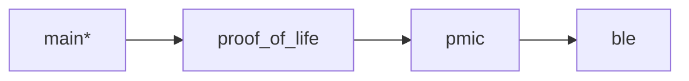

# nrf_peripheral_bfg

   
  
   
  An application/workshop on leveraging a Seeed board that hosts an nRF54L15 and nPM2100 to be a Bluetooth Low Energy (BLE) peripheral to read battery state of charge and voltage, viewing them on your mobile device, and to use your mobile device to put the device into a low power ship mode.

# Requirements
## Hardware
- **nRF54L15-DK** to use as a programmer. If you have your own jtag/swd programmer such as jlink, you do not need to use a DK.
  
  
  
- **Seeed nPM2100+nRF54L15 example design** (files can be found [here](https://nsscprodmedia.blob.core.windows.net/prod/software-and-other-downloads/reference-layouts/npm2100/qfn/2100_54l15_de.zip), should come with an LR44 coin cell battery pre-installed.)
  
  

- **2x5 programming SWD ribbon cable** (example of one [here](https://www.digikey.com/en/products/detail/adafruit-industries-llc/1675/6827142?gclsrc=aw.ds&gad_source=1&gad_campaignid=20232005509&gclid=EAIaIQobChMIsqiQ1N-EkwMVHTWtBh1wpjdTEAQYASABEgLzsfD_BwE))
  
  

- **USB-C cable if you are using an nRF54L15-DK as a programmer.**
  
  

## Software
> [!IMPORTANT]  
> You must complete the first lesson of the [Nordic DevAcademy](https://academy.nordicsemi.com/courses/nrf-connect-sdk-fundamentals/) for this workshop.
> 
> You must be able to build and be able to flash a blank application. If you do not have a DK, at the very least a successful build system is required.
> **These are large downloads and take a long time. Please complete before the workshop.**
 
### Installing and setting up nRF Connect SDK (NCS) 🔗[LINK](https://academy.nordicsemi.com/courses/nrf-connect-sdk-fundamentals/lessons/lesson-1-nrf-connect-sdk-introduction/topic/exercise-1-1/)

Versions used: NCS `v3.1.2`

This workshop assumes you've at least completed the first lesson of the nRF Connect SDK Fundamentals in the Nordic DevAcademy.
If you haven't, here is a link, but expect to be left behind! [🔗LINK](https://academy.nordicsemi.com/courses/nrf-connect-sdk-fundamentals/)

# Hands on
## High-level architecture
At a high level, we will write an application for the nRF54L15 SoC leveraging I2C to interface with the PMIC and BLE to interface with the outside world via our mobile device.

We will be using the PMIC to determine the state of charge and voltage of the battery with its fuel gauge library/algorithm, and to take the device in/out of a low power ship mode.

## Block diagram of the seeed board

## Goal and Progression Path
There are a few branches in this repo, here is the intended progression path for you as you walk through this workshop.

> `*` == your current location

## Getting Started
### Add the application to VSCode:
> [!NOTE]
> You can use strictly the extension graphic user interface (GUI) and avoid the command line interface (CLI).
> For brevity and variety sake (since the [DK predecessor of this workshop](github.com/droidecahedron/nrf_peripheral_dmm) uses the GUI, we will be leveraging the CLI here instead.

- Clone this repo with git
- Click on the nRF Connect icon in the left hand ribbon of VS Code.
- Click on 'Open Terminal', after which a terminal will open in the VSC gui.
  

- Use the terminal to change directory to the repo. (i.e. `cd ~/nrf_peripheral_bfg` or `cd C:/nrf_peripheral_bfg`)

  

- run `west build -b seeed_nrf54l15_npm2100/nrf54l15/cpuapp -p -- -DBOARD_ROOT="."`and let it build. You should be greeted with a completion and a final step of generating a merged.hex file.

  

### Getting things ready to program.
*These instructions assume you are using an nRF54L15-DK as your programmer.*
- On the Seeed board, press and hold the SHPHLD button for about 1 second. The red LED should begin blinking, indicating it is out of ship mode.
- Plug in the nRF54L15-DK via USB cable, and turn the POWER switch to the ON position.
- With your 2x5 SWD Ribbon cable, connect the DBG-OUT header of the nRF54L15-DK to the Seeed board's SWD port headers between the two push buttons, matching the silk screens lines with the red line on the swd cable. (Images below for reference).
  
  

- From here, you are ready to begin programming the board!
