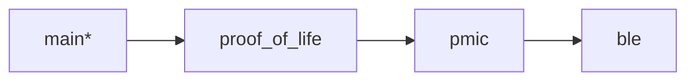

# nrf_peripheral_bfg
<p align="center">
  <br>
  
  </br>
  An application/workshop on leveraging a Seeed board that hosts an nRF54L15 and nPM2100 to be a Bluetooth Low Energy (BLE) peripheral to read battery state of charge and voltage, viewing them on your mobile device, and to use your mobile device to put the device into a low power ship mode.
</p>

# Requirements
## Hardware
- **nRF54L15-DK** to use as a programmer. If you have your own jtag/swd programmer such as jlink, you do not need to use a DK.
  
  
  
- **Seeed nPM2100+nRF54L15 example design** (files can be found [here](https://nsscprodmedia.blob.core.windows.net/prod/software-and-other-downloads/reference-layouts/npm2100/qfn/2100_54l15_de.zip), should come with an LR44 coin cell battery pre-installed.)
  
  

- **2x5 programming SWD ribbon cable** (example of one [here](https://www.digikey.com/en/products/detail/adafruit-industries-llc/1675/6827142?gclsrc=aw.ds&gad_source=1&gad_campaignid=20232005509&gclid=EAIaIQobChMIsqiQ1N-EkwMVHTWtBh1wpjdTEAQYASABEgLzsfD_BwE))
  
  

- **USB-C cable if you are using an nRF54L15-DK as a programmer.**
  
  

## Software
> [!IMPORTANT]
> There are two methods to build the application and participate in this workshop.
>
> One is local install, and one leverages a remote codespace.
> 
> If you want to build locally, you must complete the first lesson of the [Nordic DevAcademy](https://academy.nordicsemi.com/courses/nrf-connect-sdk-fundamentals/) for this workshop: 🔗[LINK](https://academy.nordicsemi.com/courses/nrf-connect-sdk-fundamentals/lessons/lesson-1-nrf-connect-sdk-introduction/topic/exercise-1-1/).
> 
> You must be able to build and flash a blank application. If you do not have a DK, at the very least a successful build system is required.
> **These are large downloads and take a long time. Please complete before the workshop if you intend on participating with this method.**
> 
> If you want to build remotely, there are instructions in the [Remote SDK](remote-sdk) section that will have smaller download links and instructions. **You must have a GitHub account to participate with the Remote SDK method.**

Versions used: NCS `v3.4.0`

# Hands on
## High-level architecture
At a high level, we will write an application for the nRF54L15 SoC leveraging I2C to interface with the PMIC and BLE to interface with the outside world via our mobile device.

We will be using the PMIC to determine the state of charge and voltage of the battery with its fuel gauge library/algorithm, and to take the device in/out of a low power ship mode.


## Block diagram of the seeed board


## Goal and Progression Path
There are a few branches in this repo, here is the intended progression path for you as you walk through this workshop.

```mermaid
graph LR;
  main*-->proof_of_life;
  proof_of_life-->pmic;
  pmic-->ble;
```
> `*` == your current location

## Getting Started
### Local install: Add the application to VSCode:
These are the instructions to follow if you have a local install of the SDK. 

If you want to leverage a remote install, skip to the [Remote SDK](remote-sdk) section.
> [!NOTE]
> You can use strictly the extension graphic user interface (GUI) and avoid the command line interface (CLI).
> For brevity and variety sake (since the [DK predecessor of this workshop](github.com/droidecahedron/nrf_peripheral_dmm) uses the GUI, we will be leveraging the CLI here instead.

- Clone this repo with git
- Click on the nRF Connect icon in the left hand ribbon of VS Code.
- Click on 'Open Terminal', after which a terminal will open in the VSC gui.
  


- Use the terminal to change directory to the repo. (i.e. `cd ~/nrf_peripheral_bfg` or `cd C:/nrf_peripheral_bfg`)

  

- run `west build -b seeed_nrf54l15_npm2100/nrf54l15/cpuapp -p -- -DBOARD_ROOT="."`and let it build. You should be greeted with a completion and a final step of generating a merged.hex file.

  

### Remote SDK
These are the instructions to follow if you intend to build remotely.

1) you must download SEGGER J-link for your respective machine OS, described in section 1 here: 🔗[LINK](https://academy.nordicsemi.com/courses/nrf-connect-sdk-fundamentals/lessons/lesson-1-nrf-connect-sdk-introduction/topic/exercise-1-1/).

2) download nrfutil: 🔗[LINK](https://www.nordicsemi.com/Products/Development-tools/nRF-Util). After downloading the nrfutil executable, it is recommended to move it to a folder that is in the system's `PATH`. On macOS and Linux, the downloaded file will also need to be given execute permission by typing `chmod +x nrfutil` or by doing this in a file browser (this is typically a checkbox found under file properties).

3) Navigate a terminal instance to the `nrfutil` install location if you haven't done so already. Run `nrfutil install device`.

4) While logged into your GitHub account, you can click the following link to spin up a codespace that will let you build with the SDK remotely: 🔗[LINK](https://codespaces.new/droidecahedron/nrf_peripheral_bfg?ref=main&quickstart=1)

It will take some time to start up. 

When it's ready, you should have a web view of a Visual Studio Code instance, and a terminal ready for your input.


4) From here, run the following command to verify the build system in the remote image is working as intended:
```
west build -b seeed_nrf54l15_npm2100/nrf54l15/cpuapp -p -- -DBOARD_ROOT="."
```

You should see it build and then return a successful message with no errors:


## Move to the proof_of_life branch for the next set of instructions: [➡️LINK](https://github.com/droidecahedron/nrf_peripheral_bfg/tree/proof_of_life)
